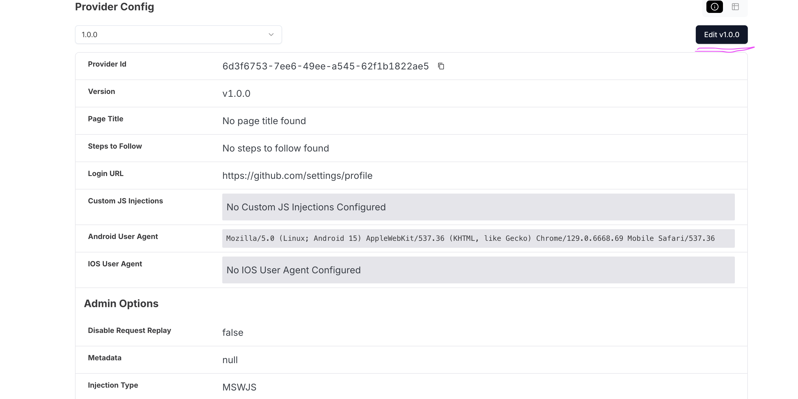
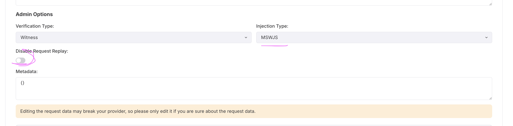
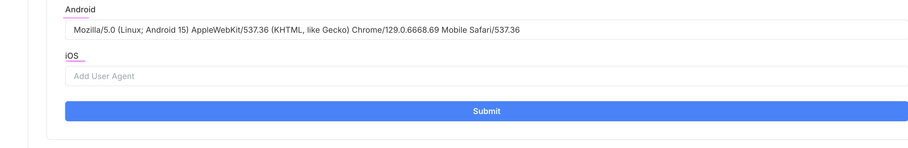

# Custom JavaScript Guide for Reclaim SDK

## Overview

When the verification flow initiates with InApp SDKs (Reclaim Verifier/AppClip), a webview launches. Upon downloading the Reclaim provider config, the InApp SDK constructs and injects a JavaScript code snippet into every webpage during load time.

## Global Objects

The following Reclaim-specific objects are added to the window object for SDK interaction:

```typescript
// Available window objects
window.payloadData; // Provider configuration
window.reclaimInterceptor; // Request/Response middleware
window.flutter_inappwebview; // SDK communication bridge

// PayloadData Interface
export interface PayloadData {
  name: string | null;
  description: string | null;
  loginUrl: string | null;
  userAgent: UserAgentSettings;
  geoLocation: string | null;
  providerHash: string | null;
  additionalClientOptions: string | null;
  useIncognitoWebview: boolean | null;
  requestData: HttpClaimRequest[];
  parameters: WitnessParameters[];
}
```

to construst a js injection, we have few injections types available in the devtool.

## Interceptor Types

Available injection types for the devtool and InApp SDK:

- **HAWKEYE** (default)
- **MSWJS**
- **XHOOK** (deprecated - not used anymore)
- **NONE** (no interceptor)

### if you are using HAWKEYE, you can use the following code to add a request and response middleware.

```javascript
/**
 * Expose the interceptor instance globally
 * This allows adding more middlewares from other scripts or the console
 *
 * This is for HAWKEYE
 */

// Add a request middleware
window.reclaimInterceptor.addRequestMiddleware(async (request) => {
  console.log('request', request);
  console.log('New request:', request.url);
});

// Add a response middleware
window.reclaimInterceptor.addResponseMiddleware(async (response, request) => {
  console.log('New response:', response.body);
});
```

### if you are using MSWJS, you can use the following code to add a request and response middleware.

```javascript
window.reclaimInterceptor.on('response', async ({ requestId, response }) => {
  console.log('requestId', requestId);
  console.log('response', response);
});
```

### Working with Intercepted Data

- If you log the request and response - you will have all the information you need to extract the data
- You can access:
  - method
  - url
  - headers
  - body
  - and more
- For response handling:
  - If the response is JSON, you can parse it directly
  - If the response is HTML, you can use a DOM parser to extract the data
- Refer to the examples in the custom-js folder for more details

## Data Extraction Tips

- Log requests and responses to access method, URL, headers, body, etc.
- Use DOM manipulation to extract data from HTML responses
- Parse JSON responses directly
- Reference examples in the `custom-js` folder

- use chatgpt for regex and dom manipulation. regex101 is also a good tool.

## Proof Generation Format

```typescript
const requestData = {
  url: '', // Endpoint URL from interceptor (not the page url - the internal api used by the website.) response.url
  headers: { ...response.headers },
  method: 'GET',
  requestBody: '', // Empty for GET requests
  responseBody: 'response', // Use actual response for POST requests
  extractedParams: {
    bankId: 1234, // Values from response parsing
  },
  geoLocation: window.payloadData.geoLocation,
  responseMatches: [
    {
      type: 'contains',
      invert: false,
      value: '{{bankId}}', // Match extractedParams key
    },
  ],
  responseRedactions: [
    {
      regex: '{{bankId}}', // Match extractedParams key
    },
  ],
  witnessParameters: { ...window.payloadData.parameters },
};
```

## Triggering Proof Generation

```typescript
window.flutter_inappwebview.callHandler('extractedData', JSON.stringify(requestData));
```

## Troubleshooting

### Website Compatibility Issues

If a website works in the default browser but not with Reclaim InApp SDK:

1. Try platform-specific user agents
2. Set `disableRequestReplay` to `true`
3. Disable injections by setting type to `NONE`





### Recommended User Agents - use only if the website is not working with the default user agent.

**Android:**

```
Mozilla/5.0 (Linux; Android 10; K) AppleWebKit/537.36 (KHTML, like Gecko) Chrome/136.0.0.0 Mobile Safari/537.36
```

**iOS/iPadOS:**

```
Mozilla/5.0 (iPhone; CPU iPhone OS 17_0_2 like Mac OS X) AppleWebKit/605.1.15 (KHTML, like Gecko) Version/17.0 Mobile/15E148 Safari/604.1
```

```

> Note: Additional user agents for different devices and platforms can be found online. The above examples work for most common scenarios.

```
